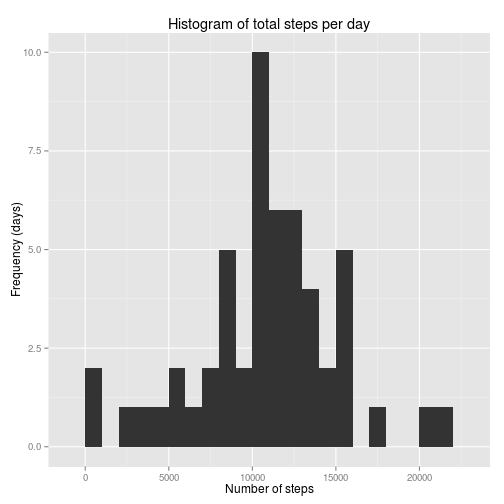
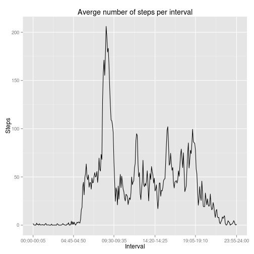
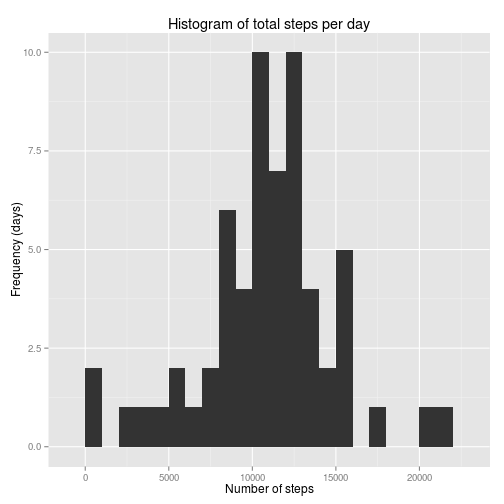

# Course Project 1 for Coursera's "Reproducible Research" class
# (by Rumen Zarev)

## Loading and preprocessing the data

Load the necessary libraries.


```r
library(magrittr)
library(dplyr)
library(ggplot2)
library(lubridate)
```

Unzip the file if necessary. Convert the date from character. Since the interval
is not actually an integer, but is in military time format (hhmm), we create
a separate table `formatting` for interpreting interval values:

* For each interval we calculate the number of minutes since midnight for
the start of the interval (which is the variable we use when plotting
intervals on the x-axis).
* In addition, for each interval we calculate a pretty-print string
as "hh:mm-hh:mm". This will be used for axis labels in the plots.


```r
if (!file.exists("activity.csv")) {
  unzip("activity.zip")
}

activity <- read.csv("activity.csv", stringsAsFactors = FALSE)
activity$date <- as.Date(activity$date)

format_minutes <- function(totalMins) {
  mins <- totalMins %/% 60
  hrs  <- totalMins %% 60
  paste(formatC(mins, width = 2, flag = "0"),
        formatC(hrs,  width = 2, flag = "0"),
        sep = ":")
}
formatting <- data.frame(interval = unique(activity$interval)) %>%
  mutate(start  = (interval %/% 100) * 60 + interval %% 100,
         pretty = paste(format_minutes(start),
                        format_minutes(start + 5),
                        sep = "-"))
```

## What is mean total number of steps taken per day?

Histogram of the total number of (recorded) steps per day.
We drop days with no observation, but keep days with partial observations.
The totals for those days use 0 for missing observations.

```r
totals <- activity %>%
  mutate(missing = is.na(steps)) %>%
  group_by(date) %>%
  summarise(steps = sum(steps, na.rm = TRUE),
            n_obs = sum(!missing)) %>%
  # Only keep days for which at least one observation was made.
  filter(n_obs > 0)

# Use variables for the reusable ggplot2 elements.
hist_labels <- labs(title = "Histogram of total steps per day",
                    x     = "Number of steps",
                    y     = "Frequency (days)")
plot1 <- ggplot(totals, aes(x = steps)) +
  geom_histogram(binwidth = 1000) +
  hist_labels
print(plot1)
```

 

Mean and median for the total number of steps:

```r
raw_total_mean <- mean(totals$steps)
raw_total_median <- median(totals$steps)
cat(paste0("Mean total steps per day:   ",
           formatC(raw_total_mean, format = "f", digits = 2),
           "\n", "Median total steps per day: ",
           formatC(raw_total_median, format = "f", digits = 2),
           "\n"))
```

```
## Mean total steps per day:   10766.19
## Median total steps per day: 10765.00
```

## What is the average daily activity pattern?

Average daily number of (recored) steps in each time interval:


```r
avg_steps <- activity %>%
  group_by(interval) %>%
  summarise(mean_steps = mean(steps, na.rm = TRUE))

# Again, create variables for the reusable plot elements.
avg_labels <- labs(title = "Averge number of steps per interval",
                   x     = "Interval",
                   y     = "Steps")
# Six marks for the axis, equally spaced.
axis_mark_nos <- c(1L, round(nrow(formatting) / 5 * 1:5))
axis_mark_pos <- formatting$start[axis_mark_nos]
axis_mark_labels <- formatting$pretty[axis_mark_nos]
interval_scale <- scale_x_continuous(breaks =  axis_mark_pos,
                                     labels = axis_mark_labels)
plot2 <- ggplot(merge(avg_steps, formatting),
                aes(x = start, y = mean_steps)) +
  geom_line() +
  avg_labels +
  interval_scale
print(plot2)
```

 

Which 5-minute interval has the highest average activity?

```r
with(merge(avg_steps, formatting),
     {
       max_index <- which.max(mean_steps)
       cat(paste0(pretty[max_index], "\n"))
     })
```

```
## 08:35-08:40
```


## Imputing missing values

How many rows have a missing value?


```r
cat(paste0(sum(1 - complete.cases(activity)), "\n"))
```

```
## 2304
```

Our strategy for imputing missing values is the following: we use the
number of average number of steps for the given time interval, on the same
day of the week. We do not average all days, since we suspect there are
variations due to a different routine on different days of the week.


```r
# Table for days of the week
days_table <- data.frame(date = unique(activity$date)) %>%
  mutate(weekday = wday(date, label = TRUE))

# Table for the means per interval/day of the week
replacements <- activity %>%
  merge(days_table) %>%
  group_by(interval, weekday) %>%
  summarise(mean_steps = mean(steps, na.rm = TRUE))

# Impute the missing values
imputed_activity <- activity %>%
  merge(days_table) %>%
  merge(replacements) %>%
  mutate(steps = ifelse(!is.na(steps), steps, mean_steps)) %>%
  select(-mean_steps, -weekday)
```

Histogram of the (interpolated) total number of steps per day:


```r
imputed_totals <- imputed_activity %>%
  group_by(date) %>%
  summarise(steps = sum(steps, na.rm = TRUE))

plot3 <- ggplot(imputed_totals, aes(x = steps)) +
  geom_histogram(binwidth = 1000) +
  hist_labels
print(plot3)
```

 

Mean and median for the imputed total number of steps:

```r
imputed_total_mean <- mean(imputed_totals$steps)
imputed_total_median <- median(imputed_totals$steps)
cat(paste0("Mean total steps per day:   ",
           formatC(imputed_total_mean, format = "f", digits = 2),
           "\n", "Median total steps per day: ",
           formatC(imputed_total_median, format = "f", digits = 2),
           "\n"))
```

```
## Mean total steps per day:   10821.21
## Median total steps per day: 11015.00
```

Difference in the mean and median due to the imputed values:

```r
difference_mean = imputed_total_mean - raw_total_mean
difference_median = imputed_total_median - raw_total_median
cat(paste0("Change in the mean total steps per day:   ",
           formatC(difference_mean, format = "f", digits = 2),
           "\n", "Change in the median total steps per day: ",
           formatC(difference_median, format = "f", digits = 2),
           "\n"))
```

```
## Change in the mean total steps per day:   55.02
## Change in the median total steps per day: 250.00
```

## Are there differences in activity patterns between weekdays and weekends?

Split the days into weekends and weekdays, and compute the mean steps per
interval for each group:

```r
weekends <- c("Sun", "Sat")

# Table for the means split by type of day
split_means <- imputed_activity %>%
  merge(days_table) %>%
  mutate(is_workday = factor(weekday %in% weekends,
                             levels = c(FALSE, TRUE),
                             labels = c("weekday", "weekend"))) %>%
  group_by(is_workday, interval) %>%
  summarise(mean_steps = mean(steps))
```

Plot the averages:


```r
plot4 <- ggplot(merge(split_means, formatting),
                aes(x = start, y = mean_steps)) +
  geom_line() +
  facet_grid(is_workday ~ .) +
  avg_labels +
  interval_scale
print(plot4)
```

 

We see that on weekdays there is a huge peak in activity before 9am,
which is not seen during weekends. On the other hand, the overall activity
later in the day is higher on weekends than on weekdays.

## Computing environment

For complete reproduciblity, we report details about the operating
system, locale, and versions of R and R packages:


```r
sessionInfo()
```

```
## R version 3.1.2 (2014-10-31)
## Platform: x86_64-pc-linux-gnu (64-bit)
## 
## locale:
##  [1] LC_CTYPE=en_US.UTF-8       LC_NUMERIC=C              
##  [3] LC_TIME=en_US.UTF-8        LC_COLLATE=en_US.UTF-8    
##  [5] LC_MONETARY=en_US.UTF-8    LC_MESSAGES=en_US.UTF-8   
##  [7] LC_PAPER=en_US.UTF-8       LC_NAME=C                 
##  [9] LC_ADDRESS=C               LC_TELEPHONE=C            
## [11] LC_MEASUREMENT=en_US.UTF-8 LC_IDENTIFICATION=C       
## 
## attached base packages:
## [1] stats     graphics  grDevices utils     datasets  methods   base     
## 
## other attached packages:
## [1] lubridate_1.3.3 ggplot2_1.0.0   dplyr_0.3.0.2   magrittr_1.0.1 
## [5] knitr_1.7       vimcom_1.0-0    colorout_1.0-3 
## 
## loaded via a namespace (and not attached):
##  [1] assertthat_0.1     colorspace_1.2-2   DBI_0.3.1         
##  [4] dichromat_2.0-0    digest_0.6.4       evaluate_0.5.5    
##  [7] formatR_1.0        grid_3.1.2         gtable_0.1.2      
## [10] labeling_0.1       lazyeval_0.1.9     markdown_0.7.4    
## [13] MASS_7.3-35        memoise_0.2.1      mime_0.2          
## [16] munsell_0.4.2      parallel_3.1.2     plyr_1.8.1        
## [19] proto_0.3-10       RColorBrewer_1.0-5 Rcpp_0.11.3       
## [22] reshape2_1.4       scales_0.2.3       stringr_0.6.2     
## [25] tools_3.1.2
```
